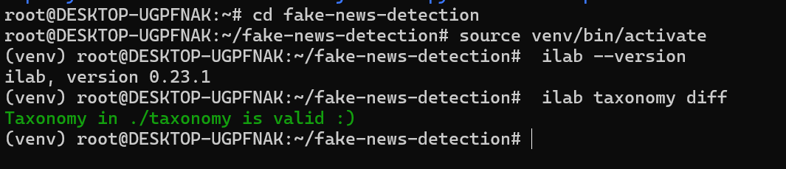
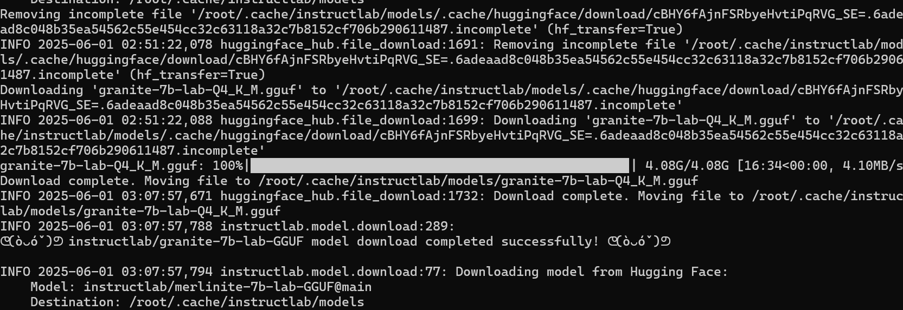
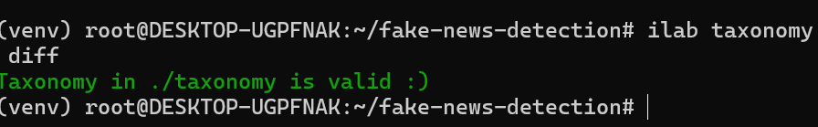

# Fake News Detection with IBM InstructLab and MLflow

This project aims to build a robust fake news detection system using IBM's **Granite language models** and the **InstructLab framework**, part of IBM's open-source effort to democratize AI model adaptation. The system will be fine-tuned on custom "skills" like claim verification, propaganda technique detection, and source credibility—tracked and managed using **MLflow** for reproducibility and comparison.

## Taxonomy Valid
 
## Granite
 
## YAML under taxonomy successufully added
 